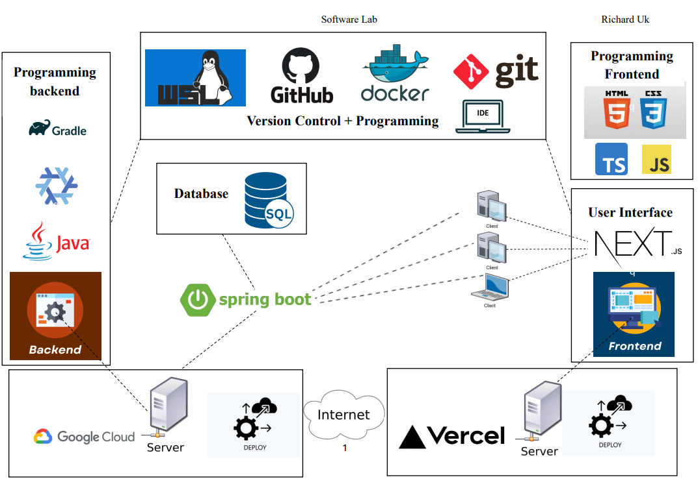
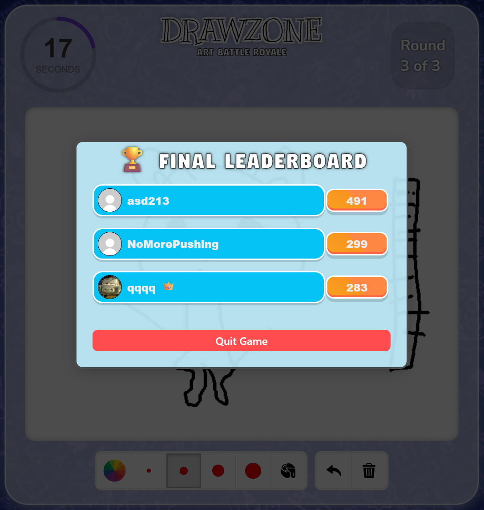

# 🎨 DrawZone - Art Battle Royale

## 🧭 Introduction
DrawZone is a real-time multiplayer party game inspired by classics like Activity. The goal is simple yet exciting: one player draws a secret word while others race against time to guess it correctly.

Our group built this game because we enjoy social games that foster creativity, quick thinking, and friendly competition. We wanted to capture that same collaborative energy in a fast-paced, browser-based environment where 2 to 8 players can have fun together.

---

## 🛠️ Technologies

<div align="center" style="margin: 24px 0;">
  
</div>

---

## 🧩 High-Level Components

### 1. **User/Player**

📁 [User Instance Backend](https://github.com/zametrics/sopra-fs25-group-09-server/blob/main/src/main/java/ch/uzh/ifi/hase/soprafs24/entity/User.java)  

The User entity represents each individual player in the system, handling both game-related behavior and persistent user information. It is central to both the lobby and game functionalities.

**Backend Structure:**

The backend `User` entity includes the following fields:

- **Long id**: Auto-generated unique identifier for each user.
- **String username**: A unique username used for identification across the platform.
- **String token**: A secure, unique token used for session authentication.
- **UserStatus status**: Enum indicating the player's current state (e.g., ONLINE, OFFLINE, IN_GAME).
- **String password** *(optional)*: Stored for authentication (not used in gameplay).
- **String dateOfBirth**: User’s date of birth stored as a string.
- **String avatarUrl**: URL of the avatar image used in-game.
- **LocalDateTime createdAt**: Timestamp indicating when the user was created (auto-generated).

> Default avatar is set during user creation to a predefined image URL.

**Key responsibilities of this component include:**

- **Player Identity**: Each user has a unique username and avatar, visible in the lobby, chat, and scoreboard.
- **Session & Token Management**: Tokens are used to securely identify and re-authenticate users during game sessions.
- **Game Status Tracking**: The `UserStatus` enum reflects whether a user is in a lobby, currently playing, or offline.
- **Real-Time Gameplay Role**: Depending on the phase of the game, a user may be assigned as a drawer or guesser, impacting their interface and functionality.
- **Scoreboard Integration**: Users' points are updated based on their actions in the game and reflected in the scoreboard.
- **Lifecycle Events**: The `@PrePersist` method ensures timestamps and default values like avatars are assigned automatically upon user creation.

This entity is foundational to DrawZone’s multi-user experience, supporting persistent identity, secure communication, and dynamic in-game roles.

---

### 2. **Lobbies**

📁 [Lobby Page Frontend](https://github.com/zametrics/sopra-fs25-group-09-client/blob/main/app/lobbies/%5BlobbyId%5D/page.tsx) `(app/lobbies/[lobbyId]/page.tsx)`  
📁 [Lobby Instance Backend](https://github.com/zametrics/sopra-fs25-group-09-server/blob/main/src/main/java/ch/uzh/ifi/hase/soprafs24/entity/Lobby.java)

Systematically having the players together, preparing the lobbies for games, each lobby with their own settings. Players can create lobbies, join to and leave from them. Once everyone is ready the lobby owner can click start and the lobby gets into the running game status.

#### General Data
- **Long id**: Each lobby has an ID of 6 digits  
- **Long numOfMaxPlayers**: Limit of number of players  
- **String playerIds**: List of players who are in the lobby, the list is updated dynamically  
- **Long lobbyOwner**: The id of the player who created the lobby, he/she is the only one who is able to change settings and start the game  
- **int status**: 0 is for lobbies waiting to start, 1 is for lobbies already ingame  

#### Gameflow Data
- **Long numOfRounds**: How many rounds the game consists  
- **int drawTime**: Time of a drawing session (each round has len(playerIds) drawing sessions)  
- **String language**: Language of the coming words  
- **String type**: Type of the coming words, default="anything"  
- **String CurrentWord**: The word to guess in the current drawing session  
- **String currentPainterToken**: Token to identify who is drawing currently (the others are guessing)  
- **String painterHistoryTokens**: The tokens are stored in here so that the same player won't draw twice in one round  

---

### 3. **Game Flow**

📁 [Game Page Frontend](https://github.com/zametrics/sopra-fs25-group-09-client/blob/main/app/games/%5BlobbyId%5D/page.tsx) `(app/games/[lobbyId]/page.tsx)`

The Game Flow is the core component that governs how the game progresses once a lobby has been initialized and all players are ready. It ensures smooth coordination between game states, real-time interactions, and round-based logic.

Once the lobby transitions into the game state, the game begins with the pre-configured settings such as number of rounds, draw time per turn, language, and word type. Each round consists of a series of drawing turns—one for each player. During a turn, a player becomes the **drawer** and receives three word choices, selecting one to illustrate. The rest of the players become **guessers**, attempting to identify the word through the drawing.

**Key responsibilities of this component include:**

- **Round Management**: Tracks how many rounds have been played and when to transition to the next one. It ensures that each player draws once per round.
- **Turn Management**: Coordinates which player is drawing and updates the game state accordingly. Uses tokens to avoid repeat painters in a round.
- **Word Selection**: Presents three random words to the drawer from the specified language and type settings, allowing them to pick one.
- **Timer Control**: Starts a countdown for each drawing session. If all guessers guess the word correctly before the timer ends, the session concludes early and advances to the next player.
- **Score Updating**: Awards points based on guess speed and accuracy. The drawer also receives points when others correctly guess their word.
- **Hint System**: As time progresses, letters of the word are gradually revealed to guessers to aid their guesses.
- **End-of-Round Transition**: At the end of each round, a brief scoreboard screen is shown. The game then proceeds to the next round or ends if the final round has been completed.
- **End-of-Game Summary**: Displays a final leaderboard ranking all players based on their scores.

This component also seamlessly integrates with other parts of the application, including the canvas drawing interface, chat system, and Socket.IO server to ensure real-time responsiveness across all connected clients. It maintains synchronization of game state and user interactions to provide a smooth and engaging gameplay experience.


---

### 4. **Socket Server**

📁 [Socket Server File](https://github.com/zametrics/sopra-fs25-group-09-client/blob/main/socket-server/index.js) `(socket-server/index.js)`

Facilitates real-time interaction using SocketIO:
- Broadcasts canvas drawing events  
- Manages round timers, player turns, and game state  
- Handles chat messages and word guessing logic  
- Syncs score and lobby events across clients  

---

# 🚀 Launch & Deployment

## Getting Started

To get started with the project, a new developer should follow these steps:

1. **Clone the Repositories**
   Clone both the frontend and backend repositories to your local machine using:

   ```bash
   git clone https://github.com/zametrics/sopra-fs25-group-09-client
   git clone https://github.com/zametrics/sopra-fs25-group-09-server
   ```

2. **Frontend Setup**
   Navigate to the frontend directory and build the project:

   ```bash
   npm run build
   ```

   After building, the application will be available by default at [http://localhost:3000](http://localhost:3000).

3. **Backend Setup**
   Navigate to the backend directory and execute the following commands:

   * To build the project:

     ```bash
     ./gradlew build
     ```

   * To run the application:

     ```bash
     ./gradlew bootRun
     ```

   * To execute tests:

     ```bash
     ./gradlew test
     ```

   The backend service will be available at [http://localhost:8080](http://localhost:8080).

## Deployment & Releases

### Docker Deployment to Google Cloud Run

After making changes in your client or socket server repository, follow these steps:

#### Rebuild the Docker Image

```bash
sudo docker build -t gcr.io/my-socket-server-456017/socket-server .
```

#### Push to Google Container Registry

Tag the image explicitly (recommended for versioning):

```bash
TAG=v1.0.0  # or use: TAG=$(git rev-parse --short HEAD)
docker build -t gcr.io/my-socket-server-456017/socket-server:$TAG .
```

Push with the tag:

```bash
docker push gcr.io/my-socket-server-456017/socket-server:$TAG
```

Deploy with the same tag:

```bash
gcloud run deploy socket-server \
  --image gcr.io/my-socket-server-456017/socket-server:$TAG \
  --platform managed \
  --region europe-west1 \
  --port 8080 \
  --allow-unauthenticated
```


---

## 🖼️ Functionalities with Illustrations
#### Major elements on the screen:  
**Canvas**: Option to change color and brush size, to fill areas, undo last step and delete drawing completely.  
**Scoreboard** (on the left): List of the players who are in the game with their earned points.  
**Chat**: The players can put their guesses in the chat and can also communicate with each other there.  
**Timer** (over the canvas on the left): Indicates time-left.  
**Word-field** (over the canvas): As the timer ticks, letters of the world are getting revealed one by one as hints.  

<p align="center">
  
</p>

---

If a player is close to the word (in terms of hamming distance), the chat says "**You're close**", maybe it was just a typo.  
<p align="center">
  
</p>

### Other important game mechanics:  
**Word Picking**: The drawer can choose from 3 appearing words.  
<p align="center">
  
</p>

**Transition between rounds**
<p align="center">
  
</p>


At the **end of the game** the leaderboard gets displayed in the middle to conclude the game.  
<p align="center">
  
</p>


**Lobby** with settings and chat
<p align="center">
  
</p>

---


**Join-Lobby** either directly or with code
<p align="center">
  
</p>

**Home**, options to create a game, join one or press Quickplay and join the best lobby. Furthermore **Edit Profile** functionality, where the username and the avatar can be changed.
<p align="center">
  
</p>

**Furthermore** if all players guessed the word correctly, the timer gets reset and the next drawing session can start immediately.  

## 🗺️ Roadmap

<p align="center">
  
</p>


## 🙌 Authors and Acknowledgment

Daniel Toth [@Danino42](https://github.com/Danino42)  
Ilias Woert [@iliasw15](https://github.com/iliasw15)  
Nikola Petrovic [@ortakyakuza](https://github.com/ortakyakuza)  
Richard Uk [@zametrics](https://github.com/zametrics)  

Thank you to our TA Lucas Timothy Leo Bär


## 🛡️ License
The project is under the [MIT](https://choosealicense.com/licenses/mit/) License


