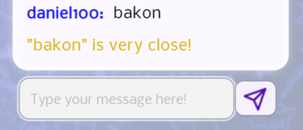

# 🎨 DrawZone - Art Battle Royale

## 🧭 Introduction
DrawZone is a real-time multiplayer party game inspired by classics like Activity. The goal is simple yet exciting: one player draws a secret word while others race against time to guess it correctly.

Our group built this game because we enjoy social games that foster creativity, quick thinking, and friendly competition. We wanted to capture that same collaborative energy in a fast-paced, browser-based environment where 2 to 8 players can have fun together.

---

## Technologies
> TODO

---

## 🧩 High-Level Components

### 1. **User/Player**
Handles each participant’s identity and gameplay status:
- Username and avatar
- Game status (lobby, drawing, guessing)
- Real-time score updates

---

### 2. **Lobbies**
📁[Lobby Page Frontend](https://github.com/zametrics/sopra-fs25-group-09-client/blob/main/app/lobbies/%5BlobbyId%5D/page.tsx)`(app/lobbies/[lobbyId]/page.tsx)`
📁[Lobby Instance Backend](https://github.com/zametrics/sopra-fs25-group-09-server/blob/main/src/main/java/ch/uzh/ifi/hase/soprafs24/entity/Lobby.java)

Systematically having the players together, preparing the lobbies for games, each lobby with their own settings. Players can create lobbies, join to and leave from them. Once everyone is ready the lobby owner can click start and the lobby gets into the running game status.

### Data stored about lobby:

#### General data
- **Long id**: Each lobby has an ID of 6 digits  
- **Long numOfMaxPlayers**: Limit of number of players  
- **String playerIds**: List of players who are in the lobby, the list is updated dynamically  
- **Long lobbyOwner**: The id of the player who created the lobby, he/she is the only one who is able to change settings and start the game  
- **int status**: 0 is for lobbies waiting to start, 1 is for lobbies already ingame  

#### Gameflow data
- **Long numOfRounds**: How many rounds the game consists  
- **int drawTime**: Time of a drawing session (each round has len(playerIds) drawing sessions)  
- **String language**: Language of the coming words  
- **String type**: Type of the coming words, default="anything"  
- **String CurrentWord**: The word to guess in the current drawing session  
- **String currentPainterToken**: Token to identify who is drawing currently (the others are guessing)  
- **String painterHistoryTokens**: The tokens are stored in here so that the same player won't draw twice in one round  

---

### 3. **Game Flow**
📁[Game Page Frontend](https://github.com/zametrics/sopra-fs25-group-09-client/blob/main/app/games/%5BlobbyId%5D/page.tsx) `(app/games/[lobbyId]/page.tsx)`

Now the game is running with the lobby settings. There is some rounds, in each round each player draws once.

Manages both **lobby** and **game** phases:
- Lobby setup: player count, round count, draw time, language, word type
- Game execution: canvas, guessing UI, chat, and scoreboard
- Transition between rounds and end-game display

---

### 4. **Socket Server**
📁[Socket server file](https://github.com/zametrics/sopra-fs25-group-09-client/blob/main/socket-server/index.js) `(socket-server/index.js)`

Facilitates real-time interaction using SocketIO:
- Broadcasts canvas drawing events
- Manages round timers, player turns, and game state
- Handles chat messages and word guessing logic
- Syncs score and lobby events across clients

---

## 🚀 Launch & Deployment
> Instructions for developers to build, run, and test the application locally.

---

## 🖼️ Functionalities with Illustrations
#### Major elements on the screen:  
**Canvas**: Option to change color and brush size, to fill areas, undo last step and delete drawing completely.  
**Scoreboard** (on the left): List of the players who are in the game with their earned points.  
**Chat**: The players can put their guesses in the chat and can also communicate with each other there.  
**Timer** (over the canvas on the left): Indicates time-left.  
**Word-field** (over the canvas): As the timer ticks, letters of the world are getting revealed one by one as hints.  

---

If a player is close to the word (in terms of hamming distance), the chat says "**You're close**", maybe it was just a typo.  

  

### Other important game mechanics:  
**Word Picking**: The drawer can choose from 3 appearing words.  

  

**Transition between rounds**

  

At the **end of the game** the leaderboard gets displayed in the middle to conclude the game.  

**Lobby** with settings and chat

  

---

**Join-Lobby** either directly or with code

  

**Home**, options to create a game, join one or press Quickplay and join the best lobby. Furthermore **Edit Profile** functionality, where the username and the avatar can be changed.

  

**Furthermore** if all players guessed the word correctly, the timer gets reset and the next drawing session can start immediately.  

## 🗺️ Roadmap

  

Kick player option

Save Your Drawing! If you really adore one of your arts you can save it and have max 3 such pictures visible on your profile. 

Circle and Rectangle drawing option

Option to make lobbies private so that foreign people can't join

---

## 🙌 Authors and Acknowledgment
> Team members and any third-party tools or inspirations you want to mention.

Daniel Toth [@Danino42](https://github.com/Danino42)  
Ilias Woert [@iliasw15](https://github.com/iliasw15)  
Nikola Petrovic [@ortakyakuza](https://github.com/ortakyakuza)  
Richard Uk [@zametrics](https://github.com/zametrics)  

Huge thank you to our TA Lucas Timothy Leo Bär

---

## 🛡️ License
The project is under MIT License

